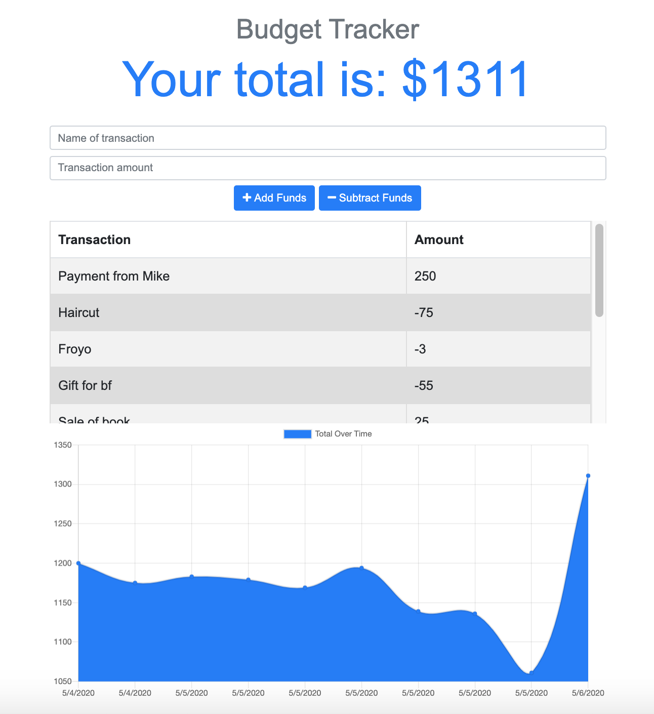

# Budget Tracker

This is a simple Budget Tracker application with offline access and functionality.

## Purpose

This app was developed with the purpose to practice adding offline functionality through indexedDB. It was an assignment of the Full Stack Web Development Bootcamp 2019-2020 from the University of Miami.

## Functionality

1. Users can input their ongoing transactions by name and amount.
2. The transactions get stored in a noSQL database (mongodb) in the server.
3. If connection is lost, transactions are stored in the client side through indexedDB.
4. When network connection is re-established, the app queries indexedDB and if there is data, it is sent to the database in the server.

## User interface

## Link to the Link to the deployed application

You can find the deployed application [here](https://blooming-woodland-00037.herokuapp.com/)